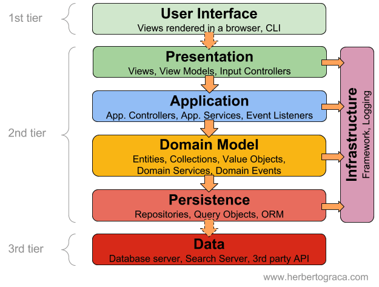
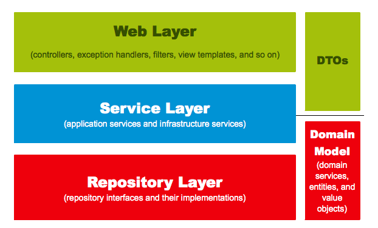
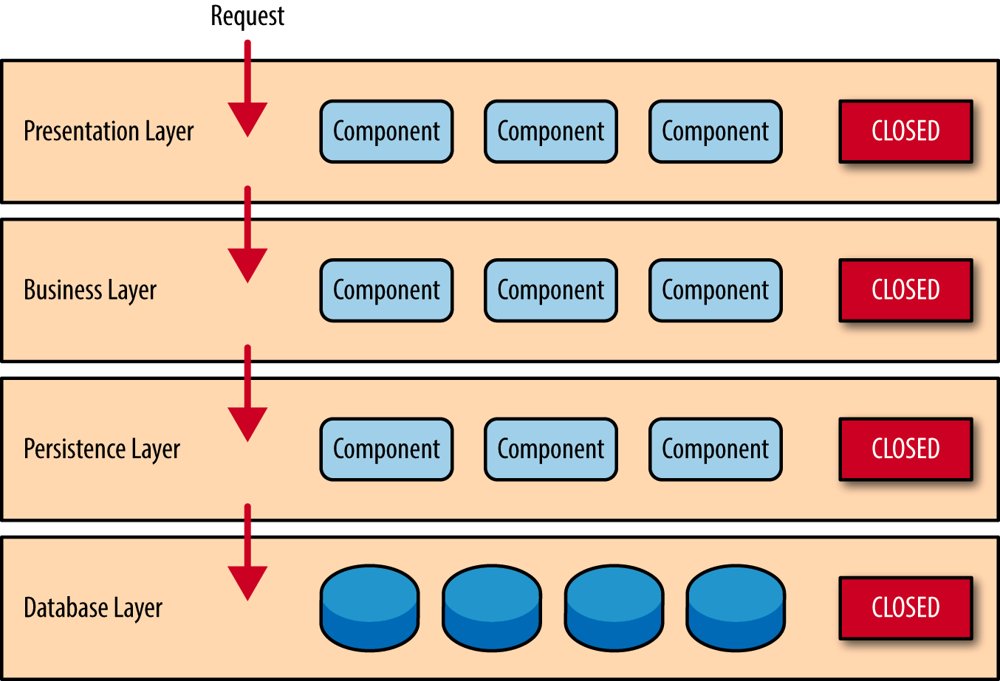

# Layered Architecture

## 계층화 아키텍처

***

Layered Architecture 는 애플리케이션의 구조를 각각 특정 기능 집합을 담당하는 별개의 분리된 계층으로 구성하는 소프트웨어 설계 패턴이다.

각 계층은 어플리케이션 내에서의 특정 역할과 관심사(화면 표시, 비지니스 로직 수행, DB 작업 등)별로 구분된다. 이는 계층화 아키텍쳐 의 강력한 기능인 `관심사의 분리 (Separation of Concern)`를 의미한다.

* 화면 표시
* 비지니스 로직 수행
* DB 작업

특정 계층의 구성요소는 해당 계층에 관련된 기능만 수행한다. 이런 특징은 높은 유지보수성과 쉬운 테스트라는 장점이 존재한다.

* 높은 유지보수성
* 쉬운 테스트

## &#x20;사용 이유

***

### 1. 모듈화

Layered Architecture 는 애플리케이션을 각각 기능의 특정 측면을 처리하는 별도의 계층으로 나누어 모듈화를 촉진한다.

### 2. 우려 사항의 분리

아키텍처는 애플리케이션을 여러 계층으로 분리하며, 각 계층에는 특정 책임 또는 관심사가 있다.(Presentation, Business, Persistence…) 이렇게 분리하면 코드를 더 쉽게 이해하고 유지 관리할 수 있다.

### 3. 확장성

Layered Architecture 는 각 계층을 독립적으로 확장할 수 있기 때문에 확장성이 뛰어난 경우가 많다. 예를 들어, 애플리케이션에서 데이터 액세스에 대한 수요가 증가하는 경우 다른 계층에 영향을 주지 않고 Data Access Layer 를 확장할 수 있다.

### 4. 유지 관리의 용이성

문제를 명확하게 분리하면 특정 레이어 내에서 문제를 찾고 해결하기가 더 쉬워진다. 전체 애플리케이션을 이해하지 않고도 하나의 레이어에서 작업할 수 있으므로(비약적이긴 하나..) 유지 관리 및 업데이트가 간소화된다.

### 5. 재사용 가능성

한 계층의 코드는 애플리케이션의 다른 부분이나 다른 프로젝트에서 재사용할 수 있다. 예를 들어 서비스 계층의 비지니스 로직은 여러 사용자 인터페이스 또는 애플리케이션에서 재사용할 수 있다.

### 6. 유연성

Layered Architecture 를 사용하면 각 계층에 맞는 기술을 유연하게 선택할 수 있다. 예를 들어, Presentation Layer에 Data Access Layer 와 다른 기술 스택을 사용할 수 있다. 이는 새로운 기술을 통합하거나 오래된 기술을 교체할 때 특히 유용하다.

### 7. 협업

여러 팀 또는 개발자가 동시에 여러 레이어에서 작업하여 병렬 개발을 촉진할 수 있다.

### 8. 상호 운용성

레이어는 잘 정의된 인터페이스 또는 API를 통해 서로 통신한다. 이를 통해 상호 운용성을 촉진하고 전체 시스템에 영향을 주지 않고 개별 레이어를 교체하거나 업그레이드할 수 있다.

### 9. 테스트

각 레이어를 독립적으로 테스트할 수 있으므로 테스트 프로세스가 간소화된다. 통합 테스트 전에 개별 레이어에 대해 단위 테스트를 수행하여 올바르게 작동하는지 확인 가능하다.

요약하면, Layered Architecture 는 소프트웨어 개발에 대한 구조적이고 체계적인 접근 방식을 제공하여 모듈화, 우려 사항 분리, 확장성, 유지 관리 용이성, 유연성 등의 이점을 제공한다. 이러한 장점으로 인해 복잡한 대규모 애플리케이션을 구축하는 데 널리 사용된다.

## 4-Tier Layered Architecture

***

계층화 아키텍처 패턴에서 구성 레이어 숫자나 각 레이어의 유형을 명시하고 있지는 않지만, 일반적인 경우 아래와 같은 유형의 4개의 레이어로 구분한다.

* Presentation Layer
* Business Layer
* Persistence Layer
* Database Layer

### Persistence Layer

***

사용자가 데이터를 전달하기 위해 화면에 정보를 표시하는 것을 주 관심사로 둔다. `Persistence Layer` 는 비지니스 로직이 어떻게 수행되는지 알 필요가 없다. 대표적인 구성요소는 View, Controller 가 있다.

* 사용자가 데이터를 전달하기 위해 화면에 정보를 표시하는 것을 주 관심사
* View, Controller

### Business Layer

***

비지니스 로직을 수행하는 것을 주 관심사로 둔다. 마찬가지로 화면에 데이터를 출력하는 방법이나 혹은 데이터를 어디서, 어떻게 가져오는지에 대한 내용은 알고있지 않다. 그저 Persistence Layer에서 데이터를 가져와 비지니스 로직을 수행하고 그 결과를 Presentation Layer 로 전달하면 된다. 대표적인 구성요소는 Service와 Domain Model 등이 있다.

* 비지니스 로직을 수행하는 것을 주 관심사
* 화면에 데이터를 출력하는 방법 혹은 데이터를 어디서 어떻게 가져오는지 관심 없음
* Persistence Layer 에서 데이터를 가져와 비지니스 로직을 수행하고 그 결과를 Presentation Layer로 전달하면 됨.
* Service, Domain Model

경우에 따라 Service와 Domain Model을 별개의 계층으로 나누거나, 아예 Domain Model을 Layered Architecture 와 별개의 것으로 분리하는 경우도 있다.

**Service 와 Domain Model을 서로 다른 계층으로 분리**

**Domain Model을 별개의 것으로 분리**

중요한것은 계층화 아키텍처 의 사용 이유와 특징을 잘 이해하고 사용하는 것.

### Persistence Layer

***

어플리케이션의 영속성을 구현하기 위해, 데이터 출처와 그 데이터를 가져오고 다루는 것을 주 관심사로 둔다. 대표적인 구성요소는 Repository, DAO 등이 있다.

### Database Layer

***

데이터베이스가 위치한 계층을 의미한다.

## 수직적으로 구성된 격리된 레이어 (Layers of isolation)

***

_출처: https://www.oreilly.com/library/view/software-architecture-patterns/9781491971437/ch01.html_

계층화 아키텍처에서 각각의 나뉘어진 수평 계층은 수직적으로 배치된다. 이는 계층화 아키텍처의 주요 특징 중 하나이다. 이런 구조에서 특정 레이어는 바로 하위 레이어에만 연결된다.

그런데 그냥 Presentation Layer 에서 Database Layer 에 연결해서 정보를 가져오는게 더 편하지 않을까? Presentation Layer 에서 직접 데이터베이스에 접속하여 데이터를 가져오게 되면,

SQL에 대한 변경사항이 Presentation Layer에 직접 영향을 미친다. → 과도한 의존성이 발생하게 된다. 이는 어플리케이션의 변경을 매우 어렵게 만든다.

계층화 아키텍처 에서 각 레이어는 격리되어 있다. 각 레이어가 다른 레이어와 독립적이므로 특정 레이어는 다른 레이어의 내부 동작을 모르게 된다. 즉 각 계층은 캡슐화되어 있고, 단일 책임을 갖는다. 따라서 특정 레이어는 다른 레이어에 영향을 주지 않고 변경될 수 있다.

* 각 계층은 격리되어 있고, 이는 캡슐화를 의미하며 단일 책임을 갖는다.
* 특정 레이어는 다른 레이어의 영향을 주지 않고 변경될 수 있다.

## Layered Architecture 시나리오

***

사용자가 특정 고객 정보를 요청한 상황을 가정하여, 계층화 아키텍처 가 이 요청을 수행하는 시나리오를 정리해보자.

1. 사용자가 보고 있는 화면(Customer Screen, 흔히 말하는 View)에서 사용자는 고객 정보를 요청한다.
2. 이 요청은 그 요청을 처리할 수 있는 모듈이 무엇인지 알고있는 Customer Delegate (흔히 말하는 Controller) 로 전달된다. Customer Delegate 는 해당 요청을 처리하기 위해 Business Layer 의 Customer Object 로 요청을 다시 전달한다.
3. Customer Object 는 요청을 받고 **비지니스 로직을 수행하기 위한 데이터를 얻기 위해**, Persistence Layer 의 Customer dao 와 Order dao 에 요청을 보낸다.
4. Persistence Layer의 DAO들은 요청을 수행하기 위해 Database Layer 에 접근하여 데이터를 가져온다.
5. 이 요청은 다시 반대로 Persistence Layer → Business Layer → Presentation Layer 로 전달되고 최종적으로 사용자에게 전달된다.

## 싱크홀 안티패턴

***

특정 레이어가 아무런 로직도 수행하지 않고 들어온 요청을 그대로 다시 하위 레이어로 보내는 경우를 의미한다. 이런 흐름은 불필요한 객체 초기화 및 처리를 빈번하게 유발하고 쓸데없는 메모리를 소모하여 성능에도 부정적인 영향을 준다.

→ 싱크홀 안티패턴이 없을 순 없으며, 전체 요청의 20% 정도면 괜찮은 수준이라 한다.

## 단점

***

### 1. 경직성과 유연성

Layered Architecture 는 시간이 지남에 따라 경직되고 유연성이 떨어질 수 있으며, 특히 다른 계층에 영향을 주지 않고 한 계층을 변경해야 하는 경우 더욱 그렇다. 한 레이어를 수정하면 여러 레이어에서 그에 상응하는 변경이 필요할 수 있으므로 시스템의 변화에 유연하지 않을 수 있다.

### 2. 성능 오버헤드

데이터와 요청이 여러 계층을 통과하기 때문에 각 계층은 일정 수준의 오버헤드를 추가한다. 이는 특히 고성능이 중요한 상황에서 시스템 성능에 영향을 미칠 수 있다.

### 3. 복잡성 증가

레이어 수가 증가하면 시스템의 복잡성도 증가한다. 복잡한 Layered Architecture 를 이해하고 유지 관리하는 것이 어려울 수 있다.

### 4. 통신 오버헤드

레이어 간 통신은 특히 데이터가 레이어 간에 이동할 때 변환해야 하는 경우 오버헤드를 유발할 수 있다.

### 5. 제한된 확장성

Layered Architecture 는 특히 사용자 수나 데이터의 양이 크게 증가할 때 확장성이 문제가 될 수 있다. 각 계층을 독립적으로 확장하는 것은 어려울 수 있으며, 한 계층의 병목 현상이 전체 시스템이 확장성에 영향을 미친다.

### 6. 종속성 관리

레이어는 종종 하위 레이어에 종속성을 가지며, 하위 레이어의 변경 사항은 상위 레이어에 파급 효과를 미칠 수 있다.

### 7. 추상화 오버헤드

Layered Architecture 의 핵심 기능인 추상화는 개발 시간과 노력 측면에서 오버헤드를 유발할 수 있다. 개발자는 계층 간의 인터페이스를 신중하게 설계하고 유지 관리해야 하며, 이러한 인터페이스의 변경은 연쇄적인 영향을 미칠 수 있다.

핵심은 아키텍처 패턴을 선택할 때 애플리케이션의 특정 요구 사항과 개발 팀의 역량을 신중하게 고려해야 한다.
