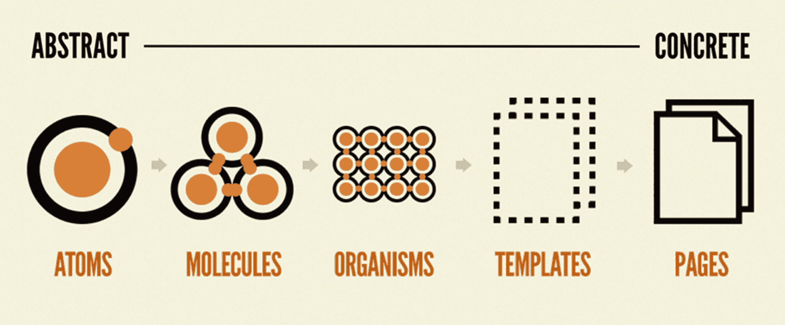
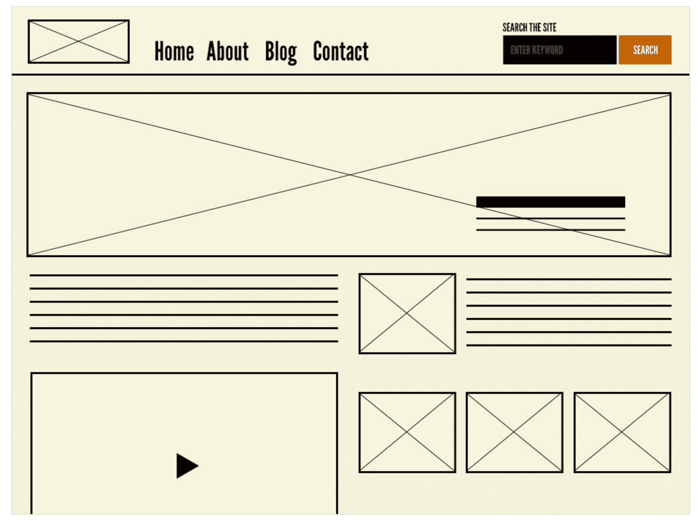
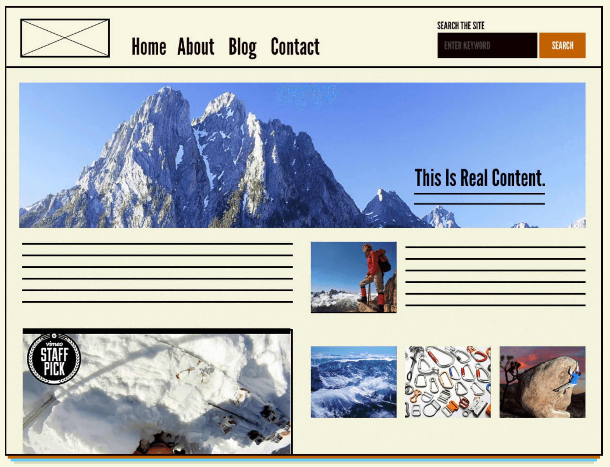
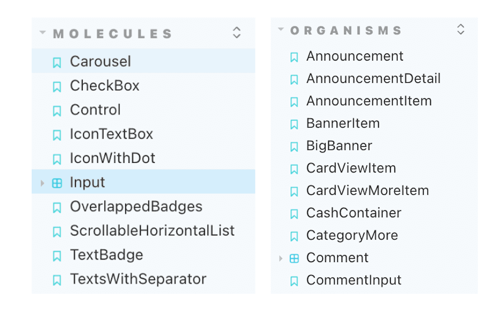
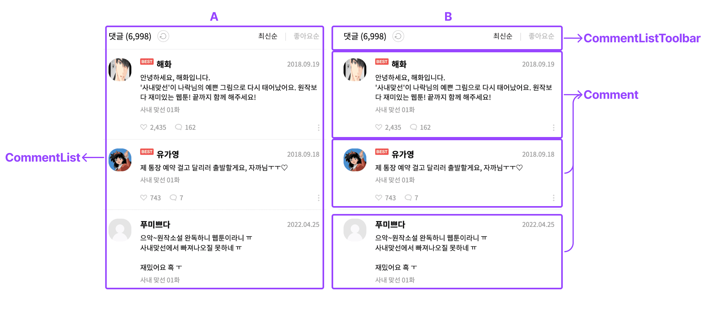

# 아토믹 디자인

## 컴포넌트의 파편화

1. 디자인시스템 내에서 관리되지 않은 버튼이 있다 (폰트 크기, 배경색, 테두리 둥글기 등) 페이지마다 제각각
2. 디자이너 혹은 유관부서와 특정 페이지의 버튼에 관해 얘기할 때 `프로필 설정 페이지의 최하단 저장 버튼` 과 `페이지 명과 위치` 를 같이 얘기해야 한다.
3. 이와 같은 대화는 불필요하게 대회 시간을 길어지게 하고,
4. 디자인 개발 부서에서도 여러 개의 버튼을 유지보수 해야한다.

## 명확한 컴포넌트 설계 기준 미비

1. 컴포넌트 구조 설계 시 명확한 기준이 없다.
2. 팀원들 각자가 생각하는 의미있는 기준으로 컴포넌트를 나눈다.
3. 성격이 비슷한 컴포넌트 끼리 묶어서 아래 이미지와 같이 페이지를 여러가지 방법으로 표현할 수 있다.

1. 제각각인 규칙으로 인해 관심사가 너무 많거나
2. 재사용이나 확장할 수 없는 컴포넌트가 생기는 문제가 있다.
3. 기준이 없으므로 구조에 대한 코드 리뷰를 하기가 어렵다.

→ 이에 따라 좋은 구조를 가진 컴포넌트를 만들기 어려운 문제가 있다.

## Atomic design

1. 위와 같은 문제는 디자인 시스템으로 어느정도 해결 할 수 있다.
2. 디자인 시스템을 통해 서비스의 고유한 타이포그래피, 컬러 팔레트 등 이러한 디자인의 기초 요소들을 만들고
3. 이것을 기반으로 공통 컴포넌트를 잘 정의하여 위 문제들을 해결할 수 있다.

### 디자인 시스템과 아토믹 디자인

1. 디자인 시스템: 어떤 조직이 디지털 인터페이스를 디자인하고 구축하는 방식에 대한 이야기라고 말한다.
2. 디자인 시스템은 여러가지 하위 시스템을 포함하는데,
   1. UI 컴포넌트
   2. variants
   3. 타이포그래피 시스템
   4. 컬러 팔레트 시스템
   5. 레이아웃 / 그리드 시스템
3. 아토믹 디자인은 디자인 시스템을 만드는 방법론이다.
4. 모든것은 atom(원자)로 구성
5. atom들이 서로 결합하여 molecule(분자)가 되고,
6. molecule(분자)는 더 복잡한 organism(유기체)으로 결합하여
7. 궁극적으로 모든 물질을 생성.

아토믹 디자인에서는 이 개념을 차용해서

1. 컴포넌트를 5가지 레벨로 나눈다.
   1. atom
   2. molecule
   3. organism
   4. template
   5. page
2. 단계별로 추상적인 것에서 구체화하는 단계를 가진다. 이 과정을 통해 일관성을 가지고 확장하면서 최종 콘텐츠를 보여줄 수 있다.

### Atom

1. 더 이상 분해할 수 없는 기본 컴포넌트이다.
2. label, input, button과 같이 기본 HTML Element 태그 혹은 글꼴, 애니메이션, 컬러 팔레트, 레이아웃과 같이 추상적인 요소도 포함.
3. atom은 모든 기본 스타일을 한눈에 보여주므로 디자인 시스템을 개발할 때 유용하게 사용된다.
4. atom은 추상적인 개념을 표현할 수 있는데 이것을 단일 컴포넌트로 사용하기엔 어려운 경우가 있다.
5. 예를 들어 레이아웃과 같은 atom 그 자체로는 실제 페이지에서 바로 사용하기에 유용하지 않을 수 있다.
6. atom + atom - molecule(분자) or organism(유기체) 여러 단위와 결합하여 유용하게 사용된다.

### Molecule

1. 여러 개의 atom을 결합하여 자신의 고유한 특성을 가진다.
2. atom들을 결합할 경우, button atom을 클릭하여 form을 전송하는 molecule로 정의할 수 있다.
3. molecule의 중요한 점은 한 가지 일을 하는 것이다.
4. SRP(Single Responsibility Principle: 단일 책임 원칙) 원칙으로 인해 키워드 전송 기능이 필요한 곳에서 재사용될 수 있다.
   1. 한 가지의 고유한 일을 함으로 인해 재사용이 가능.
5. molecule의 SRP는 재사용성과 UI에서의 일관성, 테스트하기 쉬운 조건

### Organism

1. 앞 단계보다 좀 더 복잡하고 서비스에서 표현될 수 있는 명확한 영역과 특정 컨텍스트를 가진다.
2. atom, molecule, organism 으로 구성할 수 있다.
3. header 라는 컨텍스트에 아래 3가지 요소로 구성할 수 있다.
   1. logo(atom)
   2. navigation(molecule)
   3. search form(molecule)
   4. atom, molecule에 비해 좀 더 구체적으로 표현되고 컨텍스트를 가지기 때문에 상대적으로 재사용성이 낮아지는 특성을 가진다.

_header organism_

### Template

1. 템플릿은 page를 만들 수 있도록 여러 개의 organsim, molecule로 구성할 수 있다.
2. 실제 컴포넌트를 레이아웃에 배치하고 구조를 잡는 와이어 프레임이다.
3. 실제 콘텐츠가 없는 page 수준의 스켈레톤.

_layout이 적용된 molecule과 organism으로 구성된 template_

### Page

1. 유저가 볼 수 있는 실제 콘텐츠를 담고 있다.
2. template의 인스턴스라 할 수 있다.
3. 예를 들어 장바구니 페이지에 유저가 담은 상품이 없거나 10개를 담는 다양한 template의 인스턴스를 볼 수 있다.

_여러가지 콘텐츠를 template에 적용하여 최종 UI를 보여주는 page_

1. 아토믹 디자인의 각 단계는 선형(linear) 프로세스가 아니다.
2. 오히려 UI를 응집력 있는 전체와 일부분에 대한 콜렉션으로 생각할 수 있도록 도와주는 멘탈 모델이다.
3. button과 기타 요소를 따로따로 디자인한 다음 모든 것이 합쳐져 하나의 응집력 있는 전체를 만드는 것이 아니다.
4. 즉, 1. atom → 2. molecule → 3.organism .. 이렇게 스텝 별로 나아가는 방법론이 아니다.
5. [아토믹 디자인 플로우](https://atomicdesign.bradfrost.com/chapter-4/#step-2-prepare-for-screenshotting)에서 팀원들과 페이지의 스크린샷을 찍고 고유한 UI 패턴을 카테고라이징하는 과정을 설명한다.

## Molecule과 Organism을 나누는 기준의 주관성

1. molecule은 atom으로 구성되어 SRP에 따라 1가지 책임을 지고
2. organsim은 atom, molecule, organism으로 구성되어 서비스에서 Layout를 기준으로 나눌 수 있는 영역을 갖는다.
3. 작성한 컴포넌트에 컨텍스트가 있는 경우 organism으로,
4. 컨텍스트 없이 ui 적인 요소로 SRP를 지킬 수 있다면 재사용하기 쉬운 molecule로 작성.
5. molecule의 컴포넌트 네이밍은 컨텍스트 없이 주로 UI적인 네이밍이 포함.
6. 반면 organism 네이밍은 컨텍스트가 포함.

1. 위 기준으로 판단하기 모호할 경우에는 일단 organism으로 작성한 후에 코드 리뷰를 통해 적절히 변경.

### organism을 나누는 기준

1. organism은 UI에서 명확한 영역을 갖는다. 명확한 영역에 대한 정의는 주관적이라 여러 가지 방식으로 해석될 수 있다.

1. 극단적으로 A와 같이 큰 영역을 organism이라 할 수 있고,
2. B와 같이 비슷한 유형의 ‘책임’을 그루핑하여 구분할 수 있다.
   1. `네이밍보다 organism 영역을 어떻게 구분했는지에 집중`
3. A보다는 B와 같이 `공통된 컨텍스트를 묶어 organism 컴포넌트로 표현하면 적당한 책임을 가진 컴포넌트를 작성할 수 있다`
4. 예를 들어 CommentListToolbar 컴포넌트의 경우 댓글 데이터를 다루는 책임을 가지고 있다.
5. Comment 컴포넌트는 레이아웃이나 Comment를 리스트로 표현할 때 여백 처리를 쉽게 할 수 있다.

### 약간 다른 Organism이 있을 때 중복 컴포넌트가 생기거나 불필요한 Props의 증가

1. Comment의 댓글 아이콘, 댓글 개수 영역이 빠지거나 아래와 같이 프로필 사진, 닉네임, 댓글 작성일이 1줄로 보여야하는 요구 사항이 추가된다.

댓글과 디자인이 비슷하지만 약간 다른 대댓글 디자인

1. 새로운 organism을 만들거나 혹은 댓글 아이콘과 댓글 개수 영역 노출 유무, 프로필 텍스트 1줄 보여주기에 대해 추가 props를 받아야 한다.
2. 새로운 컴포넌트를 만들자니 이런 상황마다 컴포넌트가 늘어나며 비슷한 컴포넌트의 중복이 생길 수 있다. props의 경우에도 마찬가지이다.

## 아토믹 컴포넌트의 원천은 디자이너가 작성한 피그마 컴포넌트

1. 리액트의 신뢰 가능한 단일 출처(single source of truth) 를 차용하여 → 디자이너가 작성한 `컴포넌트`, `컬러팔레트`, `타이포그래피` 등의 `네이밍`을 `리액트 컴포넌트의 네이밍과 동일하게 작성`한다.
2. 가장 큰 장점은 디자이너와 개발자가 동일한 이름을 가지고 빠르고 쉽게 대화할 수 있다.
3. 예를 들어 프로필 설정 페이지의 저장 버튼이 아닌 “solid button”, “Bottom Fixed Button” 이라는 공통된 네이밍으로 의사소통할 수 있다.
